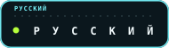

<code>SYSTEM ONLINE · PROFILE / 2026</code>

  &nbsp;&nbsp;&nbsp;&nbsp;
  &nbsp;&nbsp;&nbsp;&nbsp;
  

# Sergey Ra

Desarrollador full-stack que crea productos web enfocados, sistemas de negocio y automatización con IA.

Convierto un problema de negocio en un producto funcional y publicado: defino el recorrido del usuario, establezco límites claros para el MVP, construyo el sistema y verifico escenarios reales. Mi trabajo abarca desde landing pages precisas hasta trackers por roles, calculadoras y asistentes de IA.

## Lo que construyo

- sitios y landing pages adaptables con un recorrido claro hacia la acción;
- herramientas de flujo de trabajo y aplicaciones web basadas en roles;
- calculadoras de precios y formularios de contacto estructurados;
- asistentes de IA basados en una base de conocimiento y reglas de negocio;
- entrega fiable: despliegue, documentación y verificación de escenarios.

## Sistemas seleccionados

### FlowPilot

Un tracker de procesos diseñado como paso práctico antes de Jira: roles, flujo Kanban, visibilidad del SLA, reglas de automatización, exportación y estado persistente.

[Repositorio](https://github.com/SergioRaaa/flowpilot-jira-tracker) · [Demo en vivo](https://free.sergio.moscow/course/2026-09-08-traker/case-01-jira/Tracker/)

### Pulse Team

Un tracker para una escuela deportiva dirigido a entrenadores, atletas y familias, con asistencia, estados del recorrido, objetivos, puntuaciones y vistas específicas para cada rol.

[Repositorio](https://github.com/SergioRaaa/pulse-team-sports-tracker) · [Demo en vivo](https://free.sergio.moscow/course/2026-09-08-traker/case-02-learning/Tracker/)

### Tempo

Un tracker de hábitos enfocado, con progreso, rachas, estadísticas y persistencia local.

[Repositorio](https://github.com/SergioRaaa/tempo-habit-tracker) · [Demo en vivo](https://free.sergio.moscow/course/2026-09-08-traker/case-03-personal/Tracker/)

### Lumi

Una administradora de salón con IA que combina consultas basadas en conocimiento, selección de servicios, comprobación de horarios disponibles y reserva de citas en la web y mediante mensajes de VK.

[Demo en vivo](https://free.sergio.moscow/chat-bots/)

## Cómo trabajo

1. Aclaro el problema, las restricciones y los criterios de aceptación.
2. Divido el producto en bloques funcionales comprensibles.
3. Construyo la versión completa más pequeña y la muestro en iteraciones breves.
4. Verifico los escenarios principales, la adaptación a pantallas y los estados de error.
5. Entrego el código y la documentación; el soporte se acuerda por separado.

## Stack principal

`Python` · `FastAPI` · `PHP` · `MySQL` · `HTML` · `CSS` · `JavaScript` · `REST API` · `GitHub`

[**Portfolio**](https://free.sergio.moscow/) · [**Telegram**](https://t.me/sergiora)

---

Objetos web independientes · interfaces / sistemas / automatización

