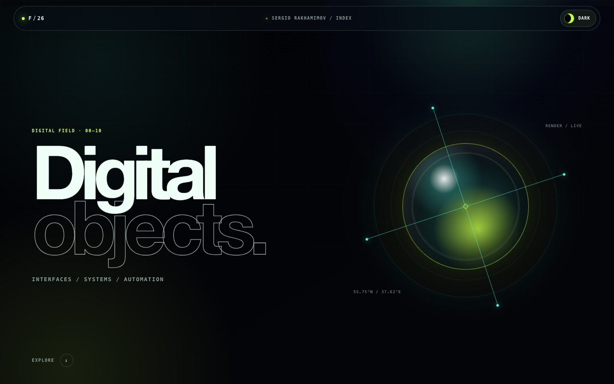
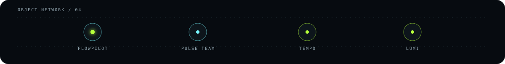
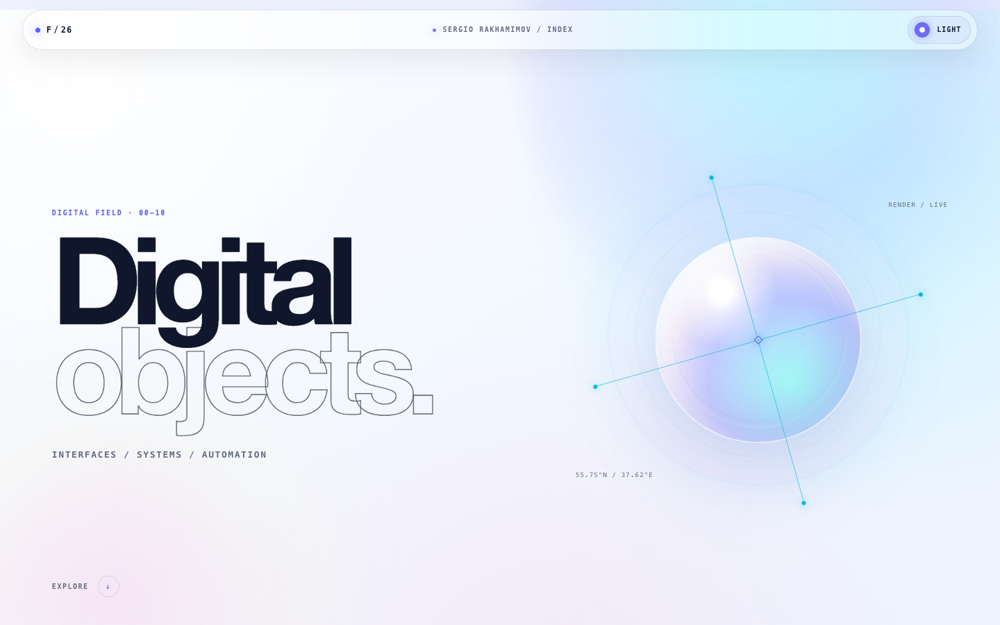

<code>SYSTEM ONLINE · PROFILE / 2026</code>

  &nbsp;&nbsp;&nbsp;&nbsp;
  &nbsp;&nbsp;&nbsp;&nbsp;
  

# Sergey Ra

Fullstack-разработчик, создающий сфокусированные веб-продукты, бизнес-системы и автоматизацию с ИИ.

Превращаю бизнес-задачу в работающий опубликованный продукт: определяю пользовательский сценарий, фиксирую понятные границы MVP, собираю систему и проверяю её на реальных сценариях. Мои работы — от точных лендингов до ролевых трекеров, калькуляторов и ИИ-ассистентов.

## Что я создаю

- адаптивные сайты и лендинги с понятным путём к целевому действию;
- рабочие инструменты и ролевые веб-приложения;
- калькуляторы стоимости и структурированные формы заявок;
- ИИ-ассистентов с базой знаний и бизнес-правилами;
- надёжную передачу: публикацию, документацию и проверку сценариев.

## Избранные системы

### FlowPilot

Трекер процессов, спроектированный как практический шаг перед внедрением Jira: роли, канбан-процесс, контроль SLA, правила автоматизации, экспорт и сохранение состояния.

[Репозиторий](https://github.com/SergioRaaa/flowpilot-jira-tracker) · [Демо](https://free.sergio.moscow/course/2026-09-08-traker/case-01-jira/Tracker/)

### Pulse Team

Трекер спортивной школы для тренеров, спортсменов и родителей: посещаемость, статусы пути, цели, баллы и отдельные представления для каждой роли.

[Репозиторий](https://github.com/SergioRaaa/pulse-team-sports-tracker) · [Демо](https://free.sergio.moscow/course/2026-09-08-traker/case-02-learning/Tracker/)

### Tempo

Сфокусированный трекер привычек с прогрессом, сериями выполнения, статистикой и локальным сохранением данных.

[Репозиторий](https://github.com/SergioRaaa/tempo-habit-tracker) · [Демо](https://free.sergio.moscow/course/2026-09-08-traker/case-03-personal/Tracker/)

### Lumi

ИИ-администратор салона, объединяющий консультацию по базе знаний, выбор услуги, проверку свободных слотов и сценарии записи через веб-интерфейс и сообщения ВКонтакте.

[Демо](https://free.sergio.moscow/chat-bots/)

## Как я работаю

1. Уточняю задачу, ограничения и критерии готовности.
2. Разбиваю продукт на понятные функциональные блоки.
3. Собираю минимальную законченную версию и показываю её короткими итерациями.
4. Проверяю основные сценарии, адаптивность и состояния ошибок.
5. Передаю код и документацию; поддержку согласовываю отдельно.

## Основной стек

`Python` · `FastAPI` · `PHP` · `MySQL` · `HTML` · `CSS` · `JavaScript` · `REST API` · `GitHub`

[**Портфолио**](https://free.sergio.moscow/) · [**Telegram**](https://t.me/sergiora)

---

Самостоятельные веб-объекты · интерфейсы / системы / автоматизация

